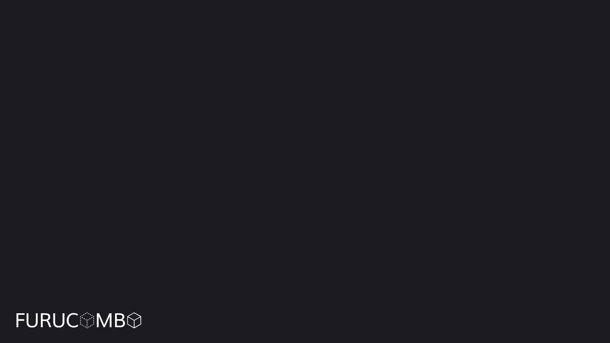

# Invest Page

<figure><figcaption>
Furucombo Invest
</figcaption></figure>

Furucombo Invest is a strategy hub that organizes investment opportunities in the DeFi space, and allows you to invest in popular platforms across the ecosystem. It is a very easy to use intuitive platform which allows even the most basic users to reap the benefits of farming and decentralized finance. This is accomplished by our two invest products, farm and fund.\

## **Farm Introduction**

Farm is a 1 button staking system which allows users to swap their single token directly into the farming contract. Users will no longer have to calculate how much liquidity must be provided for each pooled token, swap half of their tokens to balance the LP, add to the LP, and then add their LP to the farming contract. All this will be done automatically with Furucombo Invest.

Furucombo Invest also allows users to auto-compound their rewards with our Auto-Farming pools. This means any reward tokens from farming will be automatically compounded to earn even higher APY from the compounded effects. This is a very strong mechanism to grow your funds and earn the highest rewards. \
\
Additionally, Furucombo’s staking contract Trevi allows for multiple reward tokens to be earned. There is a 20% performance fee on the compounded rewards which will go back to the treasury for use via the Combo holders through governance once implemented. This is only applied to the Auto-Invest Farms by Furucombo. There is however no other fees for using the platform, no deposit or withdraw fees.

## **Fund Introduction**

Fund is our fund management system. Anyone can create a fund, where experienced fund managers will be in control of creating combos to maximize the return on investment. This allows for more diversification in investments, and allows experts to manage your funds. Fund managers are incentivized through a management fee, and/or a performance fee which is dependant on the parameters of the fund. To learn more about furucombo funds, you can visit our tutorials, [Furucombo Fund](https://docs.furucombo.app/using-furucombo-1/tutorials/furucombo-fund) & [Fund Manager Setup](https://docs.furucombo.app/using-furucombo-1/tutorials/fund-manager-setup).

## Do you charge any fees?

Furucombo has recently updated its fee structure, and it is dependent on which action or product you are using. All fees generated are deposited into the Furucombo treasury to be managed by governance. The following information is a breakdown of Furucombo’s fee structure on the invest mode.

### When fees are applied

* Pool
  1. When depositing to a pool using any token 0.2% fees are applied
* Farm
  1. When depositing to a farm using any token (with the exception of that farms LP tokens) 0.2% fees are applied&#x20;
  2. When a auto-farming pool is compounded, 20% of the rewards compounded are taken as fees
* Fund
  1. When depositing to a fund using any token (with the exception of USDC) 0.2% fees are applied

### When no fees are applied

* Farm
  1. When depositing to a farm using that farms LP tokens
     1. Example, depositing to a MATIC/WETH farm using MATIC/WETH LP tokens will not incur any fees
* Fund
  1. When depositing to a fund using USDC
