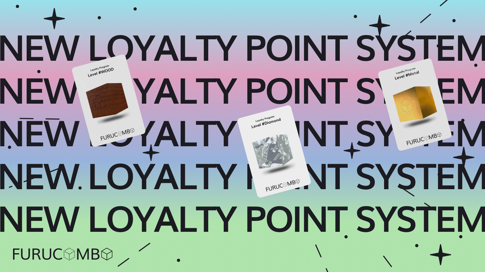
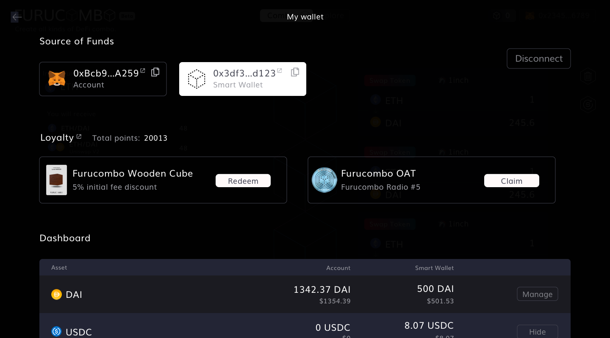

# Loyalty Program V2

<figure><figcaption></figcaption></figure>

Furucombo is happy to announce we are updating our loyalty and points program to be more inclusive of our new products that have launched. This includes the standard create mode, invest mode, and fund mode.

What’s new from the old point system:

* Points are broken up into rounds
* Points will expire at the end of each round
* The 4th round will start from April 1st, 2023, onwards 3 months. (Previous round: January 1st, 2023)

## **How to Earn Points**

With the inclusion of fees on the platform, we decided to offer reimbursements to our loyal users in the form of points. These points can be used to purchase the wooden, metal, or diamond cubes which offer a range of fee discounts.

For every $0.01 in fees charged, users can earn 1 point. This includes any initial fees, and any auto-farming fees. Fees lower than $0.01 per transaction will not earn any points. Any initial fees generated by fund managers will be split to investors of that fund.

For example, if a user performs a $1000 initial fee transaction, the fee for that transaction will be $2. That means that that user will generate 200 points from that transaction. If the user has a loyalty cube NFT, then the initial fee will be discounted at the following rate:

* Wooden Cube: 5% initial fee discount&#x20;
* Metal Cube: 10% initial fee discount&#x20;
* Diamond Cube: 20% initial fee discount

If users hold all 3 cubes, they would have up to a 31.6% discount!\
Calc.: Initial fee \* 95% \* 90% \* 80%

```
*Those with old loyalty NFTs must re-claim new contract NFTs for the discount!
```

Check your points here: [https://go.furucombo.app/9T22LF](https://go.furucombo.app/9T22LF)

## Points Interface <a href="#6e6c" id="6e6c"></a>

You can check your accumulated points on [the wallet tab](https://go.furucombo.app/pANu4B) on Furucombo.

<figure><figcaption><p>Points Interface</p></figcaption></figure>

## Transmutation: <a href="#4b20" id="4b20"></a>

**1. Wooden Cube**

* 1500 points required to mint
* 5% initial fee discount (round 2 & 3)

**2. Metal Cube**

* 3000 points + 1 Wooden Cube required to mint&#x20;
* loyalty airdrops (in tokens or in NFTs)&#x20;
* 10% initial fee discount (round 2 & 3)

**3. Diamond Cube**

* 9000 points + 1 Metal Cube required to mint
* loyalty airdrops (in tokens or in NFTs)
* 20% initial fee discount (round 2 & 3)
* Exclusive high yield farming option (WIP)
* Offline event invitations (WIP)
* VIP support & unique Discord role (WIP)


