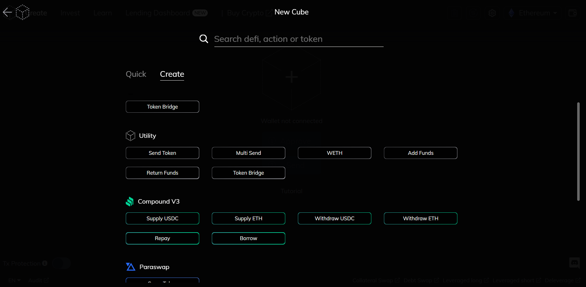
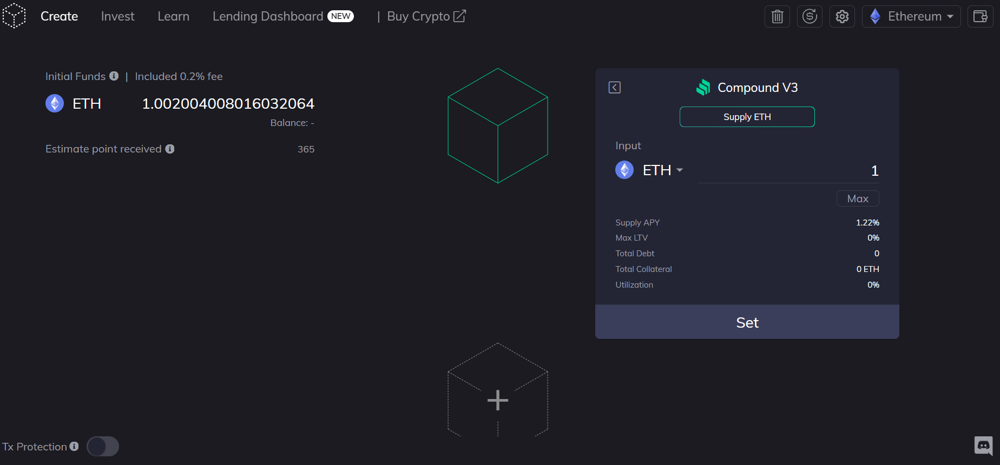
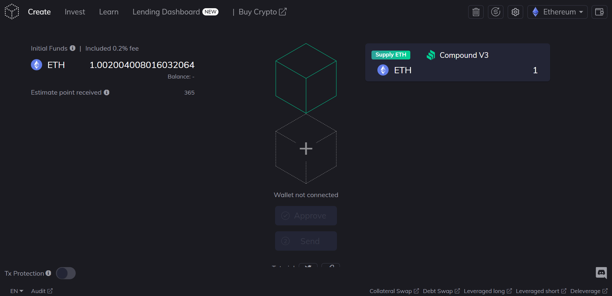
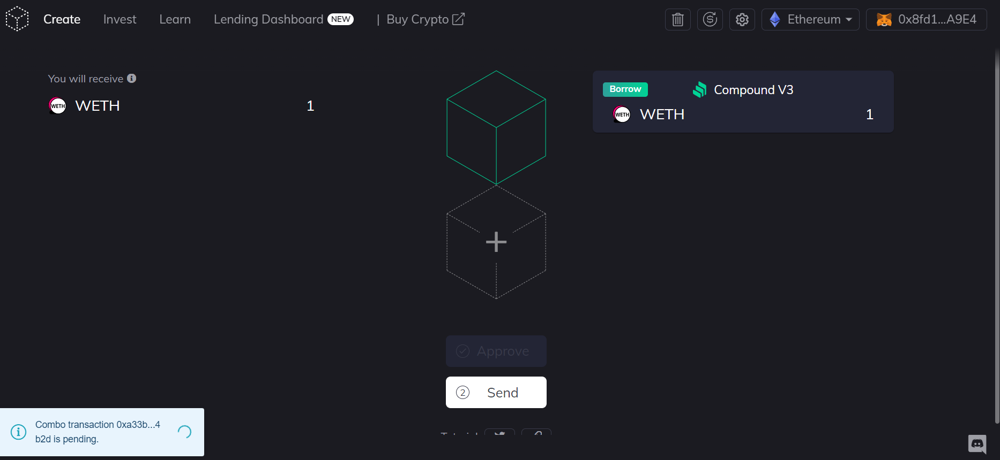
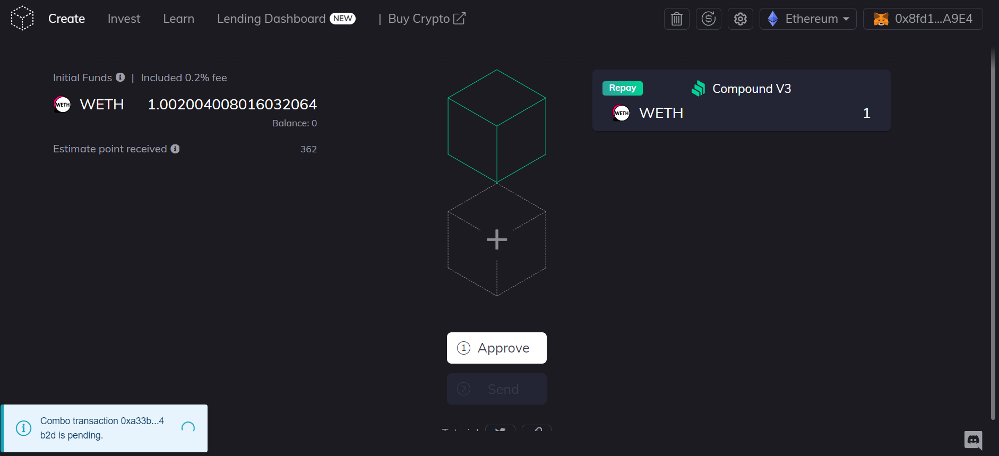

# Compound V3 Tutorial

<figure><figcaption></figcaption></figure>

Compound is a lending protocol that allows you to earn some return from your deposit, and allows you to borrow from that collateral. There is a cost to borrowing, and you can be liquidated if your debt to loan value ratio gets too high.\

Compound V3 has launched on Furucombo, and this tutorial will guide you through the new features, and how to use them. To start, we will enter the create mode on the Furucombo website. To access the new features, ensure that you’re set to the Ethereum network, Polygon network, or the Arbitrum network. Next, click the blank cube in the center, and you’ll be greeted with a list of protocols. From here, we can search the menu for Compound V3.

<figure><figcaption></figcaption></figure>

The following are the available functions for Compound V3:

* Supply USDC - Deposit USDC as collateral to earn APY and allow you to borrow
* Supply ETH - Deposit ETH as collateral to earn APY and allow you to borrow
* Withdraw USDC - Remove your collateral USDC from the protocol&#x20;
* Withdraw ETH - Remove your collateral ETH from the protocol
* Repay - Pay back your loan or debt position from the protocol allowing you to withdraw your collateral
* Borrow - Take out a loan or debt position from the protocol for a APY fee

### Making your first Deposit

1. To get started, decide which asset you want to deposit on Compound, USDC or ETH. At the time of writing this tutorial, a USDC deposit will earn you 3.5% on Ethereum, and an ETH deposit will earn you about 1.5%. When you have decided which to deposit, click either the ‘Supply ETH’ or ‘Supply USDC’ buttons.
2. Once you have clicked the button, you can input the amount you want to deposit. Then once you are happy with the amount you have selected, click ‘set’. You’ll also be greeted by the following information:

* Supply APY - The return on supplying your asset to Compound in annual percentage yield
* Max LTV - The value you can borrow from your deposited assets
* Total Debt - Total outstanding debts or borrowed assets from Compound
* Total Collateral - Total collateral or deposits on Compound
* Utilization - Percentage of money borrowed out of the total money supplied

<figure><figcaption></figcaption></figure>

3. Now you can hit ‘approve’ and ‘send’ to complete the transaction and make a deposit onto Compound V3. You will automatically start earning the supply APY rewards.

<figure><figcaption></figcaption></figure>

### Using your collateral to Borrow

1. Now that you have made a deposit into Compound V3, you can borrow from your collateral. Simply go into the DeFi menu again, and select the ‘Borrow’ cube.
2. Next select your output token, and output amount. Note that you’ll be greeted with the following information:

* Borrow APY - The cost of borrowing the asset in annual percentage yield
* Minimal borrow - The minimum amount you can borrow from your collateral
* Total Debt - Total amount of debt outstanding
* Available Borrow - How much you can borrow from your collateral
* Utilization - Percentage of money borrowed out of the total money supplied
* Base token supply - How much collateral you have supplied to the protocol

3. Once you are happy with the selection, hit ‘Set’, then hit ‘Approve’ and ‘Send’

<figure><figcaption></figcaption></figure>

#### Repaying your Debts

1. To repay your debts, simply add the ‘Repay’ cube. Next, determine the amount you want to repay. Also listed on the cube interface will be the Total Debt, Total Collateral, and Utilization to help you determine how much you want to repay. Once you have decided, insert the input token and the amount you wish to repay.
2. Next, hit ‘Set’, and ‘Approve’ and ‘Send’. Once the transaction has completed you have repaid some or all of your outstanding debt.

<figure><figcaption></figcaption></figure>

#### Withdrawing your Deposited Assets

1. Once you have repaid your debts, you can now withdraw your assets. Simply add the ‘Withdraw USDC’ or ‘Withdraw ETH’ cube and select the output token and amount. Note that the Total Debt, Total Collateral, Utilization, and Supply Balance will be displayed on the interface.
2. Next, hit ‘Set’, and ‘Approve’ and ‘Send’. Once the transaction has completed, you will have withdrawn some or all of your assets from Compound.

### Advanced Strategies

You can also chain together combinations when using the Compound cubes to do advanced features such as:

* Deposit and Borrow in one transaction
* [Debt Swap](https://docs.furucombo.app/using-furucombo/tutorials/debt-swap-tutorial) - This allows you to swap your debt position (from ETH to USDC or USDC to ETH) without first repaying your outstanding debt position using flashloans
* [Collateral Swap](https://docs.furucombo.app/using-furucombo/tutorials/collateral-swap-tutorial) - This allows you to swap your collateral position (from ETH to USDC or USDC to ETH) without first repaying your outstanding debt using flashloans
* [De-leverage](https://docs.furucombo.app/using-furucombo/tutorials/de-leverage-position-tutorial) - This allows you to close your position without any upfront funds by using flashloans and the collateral you have deposited into Compound

This is a tutorial and summary on how to utilize Compound V3 on Furucombo. If you have any questions, please let us know on our [community Discord](https://go.furucombo.app/Discord), we are always happy to assist!

